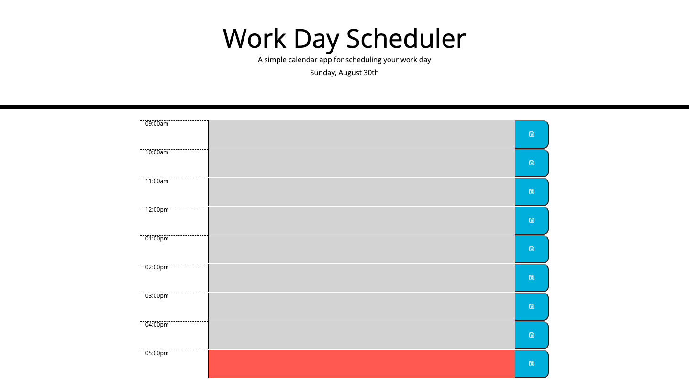

# Work Day Scheduler

## Purpose
A web application which allows the user to keep track of their workday schedule hourly, from 9am to 5pm. 

## Built with
- HTML
- CSS
- JAVASCRIPT
- JQUERY & BOOTSTRAP

## What it does
The user is able to save their schedule for each hour of the workday. The workday is separated by colors: gray = past, red = present, and green = future. The user is able to save their events upon refreshing the page and the date and time will update according to the current date and time. 

## Finished display of website

## Website link
https://1jorcarver.github.io/super-disco/

